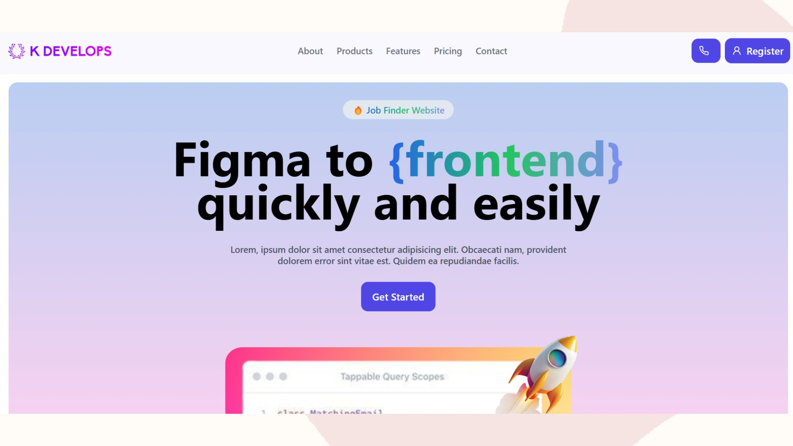

<!-- PROJECT LOGO -->
<br />
<div align="center">
  <a href="https://github.com/KaranDeveloper556/Dtox">
    
    <br/>
  </a>

  <h1 align="center">Figma Converting Website Frontend</h1>
  <p align="center">
    This is an easy level website
    <br />
    <br />
    <br />
    <a href="https://dtox-karan.netlify.app">View Demo</a>
    ·
    <a href="https://github.com/KaranDeveloper556/Dtox/issues">Report Bug</a>
  </p>
</div>
<center>
 
    <br/>
</center>

<!-- ABOUT THE PROJECT -->
## About The Project

[![Product Name Screen Shot][product-screenshot]](https://example.com)

Hey, there is an easy project for showing your skills. In this project i have used React and TailwindCSS.

### Built With

This section should list any major frameworks/libraries used to bootstrap your project. Leave any add-ons/plugins for the acknowledgements section. Here are a few examples.

* [![React][React.js]][React-url]

<p align="right">(<a href="#readme-top">back to top</a>)</p>


<!-- GETTING STARTED -->
## Getting Started

This is an example of how you may give instructions on setting up your project locally.
To get a local copy up and running follow these simple example steps.

### Prerequisites

This is an example of how to list things you need to use the software and how to install them.
* npm
  ```sh
  npm install
  ```
